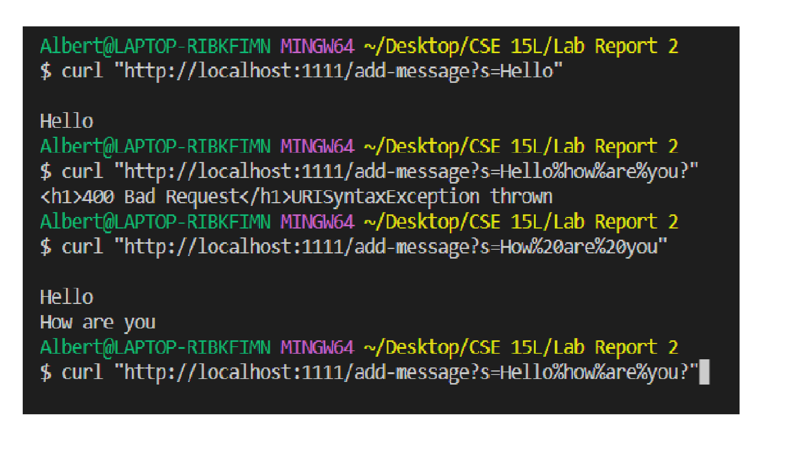

# Lab Report 2 - Servers and Bugs 


## Part 1- String Server 

<br /> Screenshot of StringServer.java code: 

<br /> 

<br /> Screenshot  of using /add-message : 

<br /> 

<br /> When I use the command curl "http://localhost:1111/add-message?s=Hello" and "http://localhost:1111/add-message?s=How20%are20%you" 
the handleRequest method from the ServerHttpHandler class is being used, as it handles incoming HTTP requests and delegates the request to 
the appropriate URLHandler implementation, in this case, the StringHandler instance. The StringHandler implementation then processes the request and 
returns the appropriate response.

<br />  When handleRequest method of ServerHttpHandler is called with a valid HTTP request, the handleRequest method of the
StringHandler instance is called with the parsed URI from the request. The relevant arguments to the handleRequest method of StringHandler are:
URI uri: The parsed URI from the incoming HTTP request. This URI should contain 
a query string with a single parameter "s" containing the string to be added to the server's state.
The StringHandler class has a single field, message, which represents the current state of the server. The value of the message 
field is a StringBuilder instance that contains the current message that has been accumulated through previous requests.
After handling a request to add a new message, the message field is updated to include the newly added message.

<br /> In the handleRequest method, the value of the message field gets updated to include the new message added to the server. Specifically,
the message field is updated by concatenating a new line and the string after s= in the query string to the current value of message


## Part 2 - String Server

<br />  **Failure-inducing input:**
```
@Test 
public void testReverseInPlace_Failure() {
    int[] input1 = { 1, 2, 3 };
    ArrayExamples.reverseInPlace(input1);
    assertArrayEquals(new int[]{ 3, 2, 1 }, input1);
}

```
<br /> **Input that doesn't induce a failure:**
```
@Test 
public void testReverseInPlace_NoFailure() {
    int[] input1 = { 1, 2, 3, 4 };
    ArrayExamples.reverseInPlace(input1);
    assertArrayEquals(new int[]{ 4, 3, 2, 1 }, input1);
}
```

<br /> **Symptom:**
<br /> When running the two tests above in JUnit, the testReverseInPlace_Failure test will fail, whereas testReverseInPlace_NoFailure will pass.

<br /> **Bug:** 
<br /> The bug in the reverseInPlace method is that it does not actually reverse the input array. 
Instead, it sets each element to the corresponding element from the end of the array. This means that when it sets arr[0] to arr[arr.length - 1],
it overwrites the original value of arr[arr.length - 1] before it has a chance to copy it to arr[0].

<br /> **Before-and-after fix:**
```
// Before fix
static void reverseInPlace(int[] arr) {
  for(int i = 0; i < arr.length; i += 1) {
    arr[i] = arr[arr.length - i - 1];
  }
}

// After fix
static void reverseInPlace(int[] arr) {
  for(int i = 0; i < arr.length / 2; i += 1) {
    int temp = arr[i];
    arr[i] = arr[arr.length - i - 1];
    arr[arr.length - i - 1] = temp;
  }
}

```
<br />**Why it works:**
<br /> The fix is to swap each element from the beginning of the array with its corresponding element from the end of the array.
This is done by iterating only up to half the length of the array (since we're swapping pairs of elements),
and using a temporary variable to hold one of the values during the swap.By swapping each element with its corresponding element from the
end of the array, we correctly reverse the order of the array. 
The use of a temporary variable ensures that we don't overwrite any values before we've had a chance to copy them to their new location.


## Part 3- What I learned
<br /> One key learning outcome from identifying and fixing bugs in code is the importance of thorough testing.
In this exercise, we demonstrated how adding additional tests can reveal bugs in code that were not caught by the original tests. By identifying and understanding the bugs, we also gained a deeper understanding of how the code works and how to write correct implementations.
This process can help developers become more confident in their code and can ultimately lead to more reliable and maintainable software.
